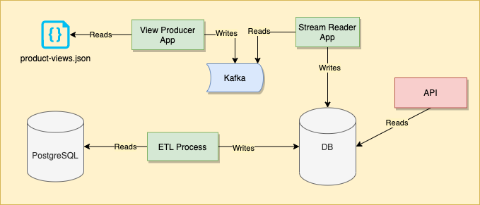
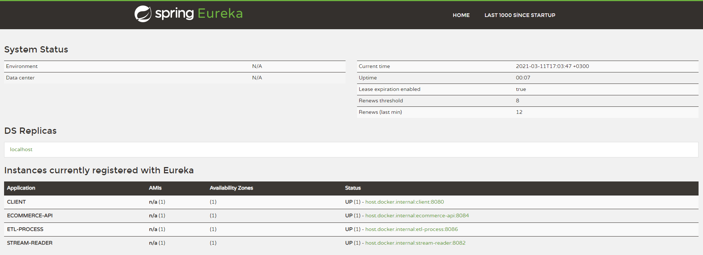
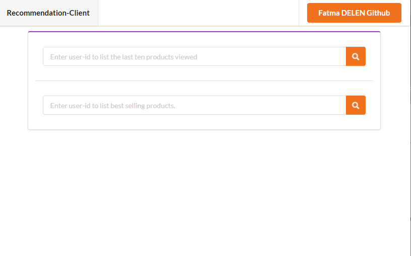
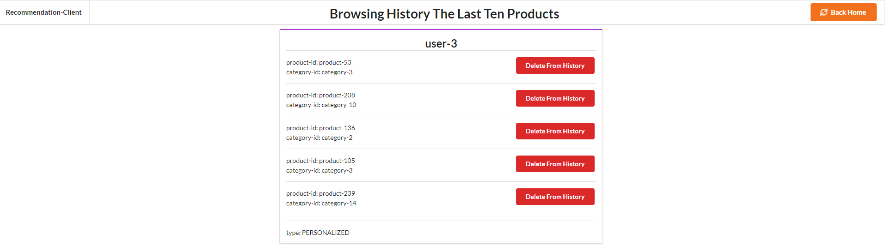
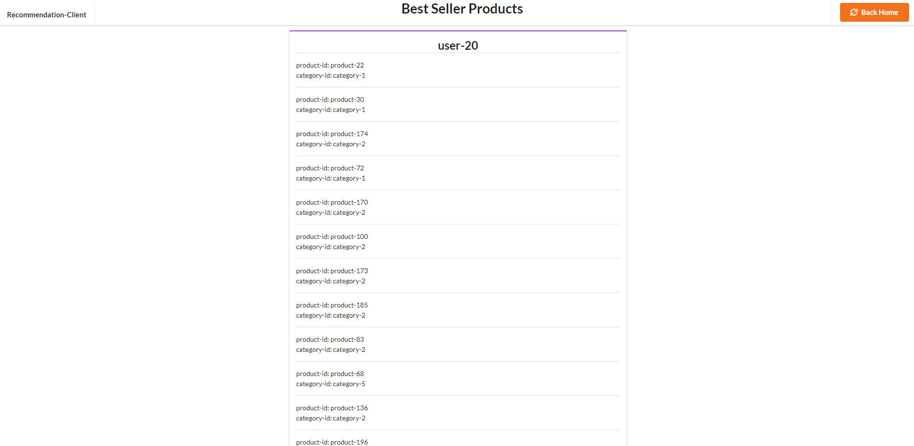

# Recommendation Engine
The goal of this project is to implement a " create a real-time recommendation engine " processing pipeline composed of six Spring Boot applications: eureka, viewproducer, streamreader, etl, ecommerce  and  client.
## Technologies used
>Eureka: 

Eureka as service registration and discovery.
>Thymeleaf: 

Thymeleaf as HTML template.

> Spring Kafka:

Spring Kafka as applies core Spring concepts to the development of Kafka-based messaging solutions. It provides a "template" as a high-level abstraction for sending messages.
>Spring Cloud OpenFeign:

Spring Cloud OpenFeign as to write web service clients easily;
## Project Architecture

## Applications
- View Producer
> Spring Boot Java application that a clickstream product view producer.
- Stream Reader
>Spring Boot Java application that a streaming read views from Kafka and integrate with API
- Etl Process
>Spring Boot application that a batch category based and general best sellers flow and integrate with API
- Ecommerce API
>Spring Boot Web Java application that a recommendation Rest API to provide given endpoints (API)
- Client
>Spring Boot Web java application that provides a User Interface to see the recommendation products.
## Start Environment
- Open a terminal and inside root folder run
>docker-compose up -d
- Wait until all containers are Up (healthy). You can check their status by running
>docker-compose ps

## Running Applications with Gradle
Inside Projects root folder, run the following gradle commands in different terminals
- Eureka Server
>gradlew bootRun -Dserver.port=8761
- View Producer
>gradlew bootRun -Dserver.port=8081
- Stream Reader
>gradlew bootRun -Dserver.port=8082
- Etl Process
>gradlew bootRun -Dserver.port=8083
- Ecommerce API
>gradlew bootRun -Dserver.port=8084
- Client
>gradlew bootRun -Dserver.port=8080

## Running Applications as Docker containers
### Build Application’s Docker Image
In a terminal, make sure you are in root folder
In order to build the application’s docker images, run the following script
>./build-docker.sh
>
## Applications URLs
| Application | URL |
| --- | --- |
| Ecommerce | http://localhost:8084/swagger-ui.html |
| Client | http://localhost:8080 |

## Useful links
- Eureka
> Eureka can be accessed at http://localhost:8761

- Swagger UI
> Swagger UI can be accessed at http://localhost:8084/api/doc/swagger-ui/index.html
- Client
> Client can be accessed at http://localhost:8080

## Pages
- Home
> 
- Browsing History The Last Ten Products
> 
- Best Seller Products
> 

